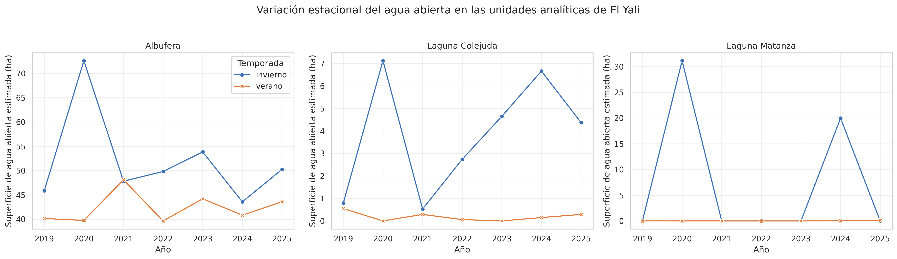
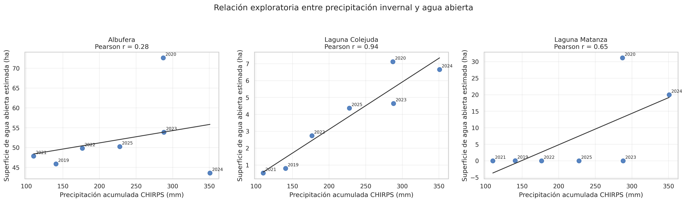

# Dinámica multitemporal de los humedales de El Yali

Caso de estudio de teledetección y análisis de datos ambientales aplicado a tres unidades de humedal de la Región de Valparaíso: Albufera, Laguna Colejuda y Laguna Matanza.

## Objetivo

Caracterizar la variación estacional del agua abierta y la condición de la vegetación entre 2019 y 2025, integrando observaciones Sentinel-2, índices espectrales y precipitación CHIRPS.

El proyecto busca responder dos preguntas:

1. ¿Cómo cambia la superficie con respuesta espectral de agua entre invierno y verano?
2. ¿Las tres unidades presentan la misma relación entre precipitación, agua abierta y vegetación?

## Diseño analítico

- composiciones estacionales comparables de Sentinel-2 Surface Reflectance Harmonized;
- enmascaramiento de nubes y sombras mediante la clasificación SCL;
- estimación de agua abierta con MNDWI y análisis de sensibilidad de umbrales;
- evaluación de la condición media de la vegetación mediante NDVI;
- precipitación acumulada estacional obtenida de CHIRPS;
- comparación espacial entre Albufera, Laguna Colejuda y Laguna Matanza;
- estadística descriptiva y correlaciones exploratorias por unidad y temporada;
- validación visual de los resultados espectrales.

## Resultados principales

- La Albufera mantuvo la presencia más persistente de agua abierta durante el periodo analizado.
- Laguna Colejuda presentó una marcada contracción estival y la asociación invernal más consistente entre precipitación y agua abierta.
- Laguna Matanza mostró pulsos de agua abierta concentrados en 2020 y 2024, junto con valores de NDVI que evidencian una respuesta vegetal relevante en años sin agua abierta detectable.
- El análisis desagregado evitó atribuir una única dinámica a humedales con funcionamiento ambiental diferente.

Los valores obtenidos corresponden a sectores analíticos y no constituyen superficies oficiales ni una restitución de límites legales.

### Variación estacional del agua abierta

### Precipitación invernal y agua abierta

## Contenido

- [Notebook de análisis](notebooks/01_analisis_resultados_el_yali.ipynb): control de calidad, estadística descriptiva y visualizaciones con Python.
- [Resultados generales](data/results/): tablas y figuras del análisis temporal agregado.
- [Resultados por sector](data/results/sector_analysis/): indicadores desagregados, sensibilidad MNDWI y relaciones exploratorias con precipitación.

## Alcance

Este repositorio presenta un caso de estudio de portafolio. Los resultados son exploratorios, no reemplazan mediciones en terreno y no constituyen monitoreo oficial, evaluación ambiental ni una herramienta para decisiones operacionales.
